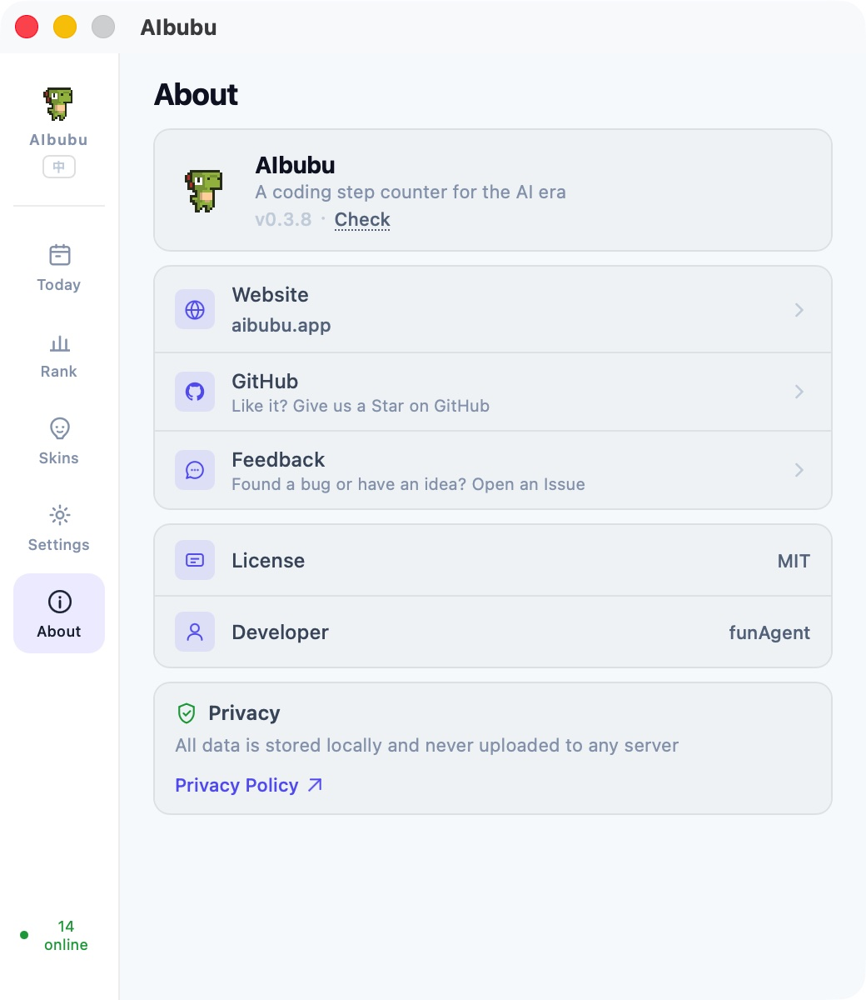

<div align="center">

# AIbubu

**A coding step counter for the AI era**

Monitor your AI coding tool activity, turn it into step counts, and drive a desktop pet to walk.

[Website](https://aibubu.app) · [中文](./README_CN.md) · [](https://github.com/funAgent/ai-bubu/releases)
[](./LICENSE)
[](https://github.com/funAgent/ai-bubu/stargazers)
[](https://github.com/funAgent/ai-bubu/releases)

https://github.com/user-attachments/assets/2b42508f-95e7-4a6b-b0eb-02efa23425c5

</div>

---

## What is it?

AIbubu is a desktop pet app that monitors your usage of AI coding tools like Cursor, Claude Code, Codex, Trae, and quantifies your "coding activity" into steps — the more active you are, the faster your pet runs. 

- **Idle** — you're slacking off
- **Walk** — you're coding at a gentle pace
- **Run** — you and AI are in great sync
- **Sprint** — you're on fire

|                            Idle                            |                            Walk                            |                            Run                            |                            Sprint                            |
| :--------------------------------------------------------: | :--------------------------------------------------------: | :-------------------------------------------------------: | :----------------------------------------------------------: |
|  |  |  |  |

## Features

### AI Tool Activity Monitoring

AIbubu monitors your AI coding tools in real-time through a pluggable adapter system — no hooks to install, no config to change. It reads existing local data (databases, logs, process info) passively.

- **Cursor** — polls the local SQLite database (`state.vscdb`), maps Composer statuses like `generating` / `streaming` to high activity
- **Claude Code** — parses JSONL session logs under `~/.claude/projects/`
- **Codex CLI** — parses `rollout-*.jsonl` session logs
- **Trae** — monitors process CPU usage
- **Process fallback** — when the primary adapter finds nothing, each provider can fall back to process-level CPU detection automatically
- **Multi-tool boost** — using multiple AI tools simultaneously accelerates your pet's progression (2 tools ×1.8, 3+ tools ×2.5 speed multiplier)
- **Community extensible** — add support for any tool by writing a TOML config file; 5 adapter types available (`sqlite` / `jsonl` / `process` / `file_mtime` / `vscode_ext`)

### Movement & Mood

**Movement** — your pet's speed reflects how long you've been actively coding:

| State  | Condition    | Score  |
| :----: | :----------- | :----- |
|  Idle  | No activity  | 0      |
|  Walk  | Active < 60s | 25–49  |
|  Run   | Active 60s+  | 50–74  |
| Sprint | Active 180s+ | 75–100 |

A **45-second cooldown bridge** keeps the pet moving during brief gaps between agent tool calls, so your coding flow feels continuous.

**Mood** — visual effects layer on top of movement:

| Mood       | Trigger                       | Visual Effect                                |
| :--------- | :---------------------------- | :------------------------------------------- |
| Sleepy 💤  | Idle for 10 minutes           | Drifting "zzz" letters + breathing + dimming |
| Excited 🔥 | Sprint or activity score ≥ 90 | Speed smoke puffs + shake + glow             |
| Normal     | Default                       | No effects                                   |

### Pet Interaction

- **Single click** — pat reaction with floating ❤️ 💕 particles
- **Double click** — poke reaction with ❗ ❓ particles
- **Hold & drag** — grab the pet and drag it anywhere on screen (150ms hold threshold to distinguish from clicks)
- **Right-click** — open the social panel
- **Hover tooltip** — "Hold to drag" / "Click to interact · Right-click for menu"

### Step Counter & Insights

- **Daily steps** — each monitor tick adds `⌊score / 10⌋` steps based on your current activity score
- **90-day history** — stored locally, rolls over at local midnight
- **Insights dashboard**:
  - 7-day and 30-day trend charts
  - 24-hour activity heatmap
  - AI tool usage breakdown (active minutes per provider)
  - Consecutive active days streak

### Skin System

8 built-in skins with custom import support:

|                              Vita                               |                              Tard                               |                              Mort                               |                              Doux                               |                              Boy                               |                              Dinosaur                               |                              Glube                               |                              Line                               |
| :-------------------------------------------------------------: | :-------------------------------------------------------------: | :-------------------------------------------------------------: | :-------------------------------------------------------------: | :------------------------------------------------------------: | :-----------------------------------------------------------------: | :--------------------------------------------------------------: | :-------------------------------------------------------------: |
|  |  |  |  |  |  |  |  |

- **Custom import** — import from folder or ZIP archive
- **Multiple formats** — Sprite Sheet (PNG), Lottie, GIF, APNG
- **4 required animation states** — idle / walk / run / sprint, each with configurable frame rate, frame count, and start frame
- **Downloadable template** — built-in example with creation guide

### LAN Social 

- **Auto-discovery** — UDP broadcast on port 23456, finds teammates on the same network automatically
- **Leaderboard** — ranked by daily step count
- **5-second heartbeat** — syncs nickname, steps, activity score, movement state, and skin in real-time
- **Pet escort** — online teammates appear as miniature pets walking alongside yours
- **Privacy-first** — LAN-only, no server, no account required

### System

- **Transparent window** — frameless, transparent background, always on top, hidden from taskbar
- **macOS fullscreen overlay** — optionally keep the pet visible over fullscreen apps (NSPanel)
- **System tray** — show/hide pet, leaderboard, quit; tray icon updates with live pet sprite frames
- **Launch at login** — auto-start on macOS / Windows / Linux
- **Auto-update** — checks GitHub Releases for new versions, download and install in-app
- **Bilingual UI** — Chinese / English, auto-detects system language
- **Theme** — Light / Dark / System
- **Privacy** — all data stored locally, nothing uploaded to any server
- **Cross-platform** — macOS 14+, Windows, Linux (AppImage / deb)

## Screenshots

|                                 Today                                  |                              Leaderboard                              |
| :--------------------------------------------------------------------: | :-------------------------------------------------------------------: |
|  |  |

|                                Skins                                 |                                 Settings                                 |                                 About                                  |
| :------------------------------------------------------------------: | :----------------------------------------------------------------------: | :--------------------------------------------------------------------: |
|  |  |  |

## Installation

### macOS

Download the latest `.dmg` from [Releases](https://github.com/funAgent/ai-bubu/releases).

> Requires macOS 14.0+

### Windows

Download the latest `.msi` from [Releases](https://github.com/funAgent/ai-bubu/releases).

### Linux

Download `.AppImage` or `.deb` from [Releases](https://github.com/funAgent/ai-bubu/releases).

## Build from Source

### Prerequisites

- [Node.js](https://nodejs.org/) 22+
- [pnpm](https://pnpm.io/) 9+
- [Rust](https://www.rust-lang.org/tools/install) (stable)
- Tauri 2 system dependencies: see [Tauri docs](https://v2.tauri.app/start/prerequisites/)

### Steps

```bash
# Clone the repo
git clone https://github.com/funAgent/ai-bubu.git
cd ai-bubu

# Install dependencies
pnpm install

# Development mode
pnpm tauri dev

# Development mode (with mock peer data)
pnpm dev:mock

# Build for production
pnpm tauri build
```

## Project Structure

```
packages/
├── app/                 # Tauri desktop application
│   ├── src/             # Vue 3 frontend
│   ├── src-tauri/       # Rust backend
│   ├── providers/       # AI tool monitor configs (TOML)
│   └── public/skins/   # Built-in skin assets
└── site/                # Astro marketing site
scripts/                 # Utility scripts
```

## Adding Custom Providers

AIbubu's monitoring is driven by TOML config files. Adding support for a new AI tool is as simple as writing a `.toml` file — no code changes needed. See the [Provider Configuration Guide](./packages/app/providers/README.md) for templates and instructions.

## Tech Stack

| Layer             | Technology                                          |
| ----------------- | --------------------------------------------------- |
| Desktop framework | Tauri 2, Rust                                       |
| Frontend          | Vue 3, Pinia, Vite                                  |
| Website           | Astro                                               |
| Testing           | Vitest                                              |
| Tooling           | pnpm workspace, ESLint, Prettier, Husky, commitlint |

## Contributing

Contributions are welcome! Please read [CONTRIBUTING.md](./CONTRIBUTING.md) for details.

### Contributors

<a href="https://github.com/funAgent/ai-bubu/graphs/contributors">
  
</a>

## Contact

<div align="center">

[](https://x.com/funAgentApp)
[](https://x.com/hash-panda)

</div>

## Support

If AIbubu makes your coding sessions more fun, consider giving it a ⭐ — it helps others discover the project!

[](https://github.com/funAgent/ai-bubu)

## Star History

<div align="center">

[](https://star-history.com/#funAgent/ai-bubu&type=date&legend=top-left)

</div>

## Credits

- Pixel dinosaur characters by [arks](https://arks.itch.io/) (itch.io)

## License

[MIT](./LICENSE)
