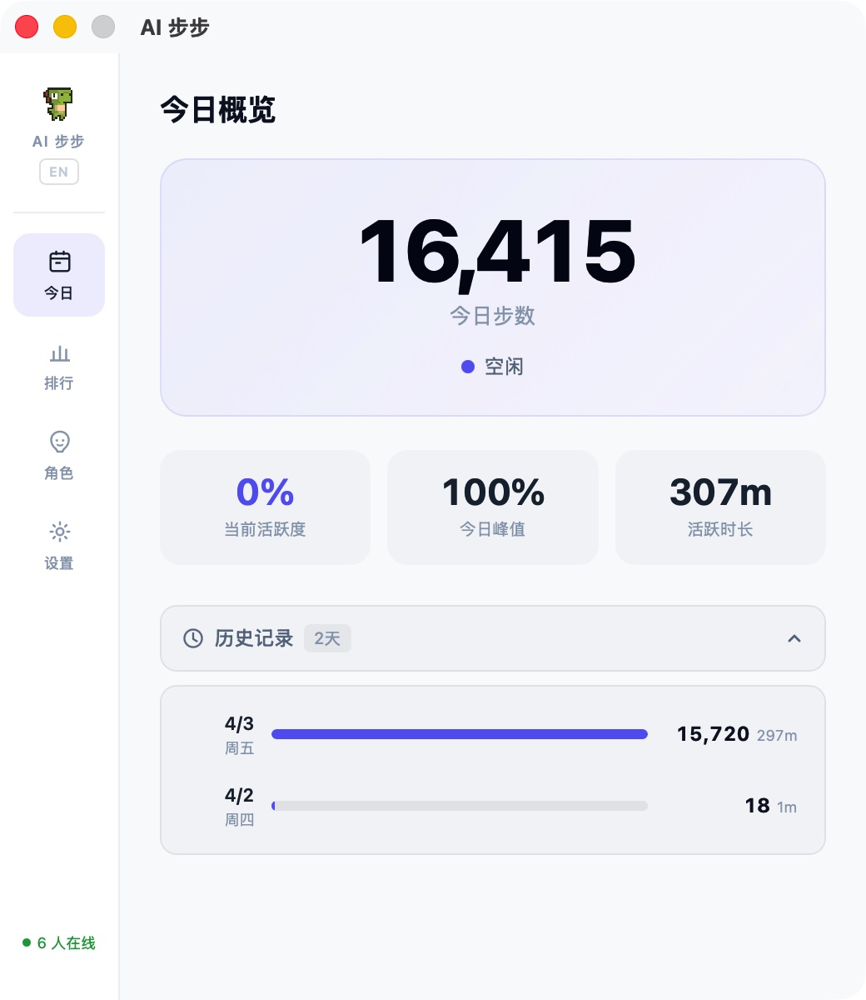
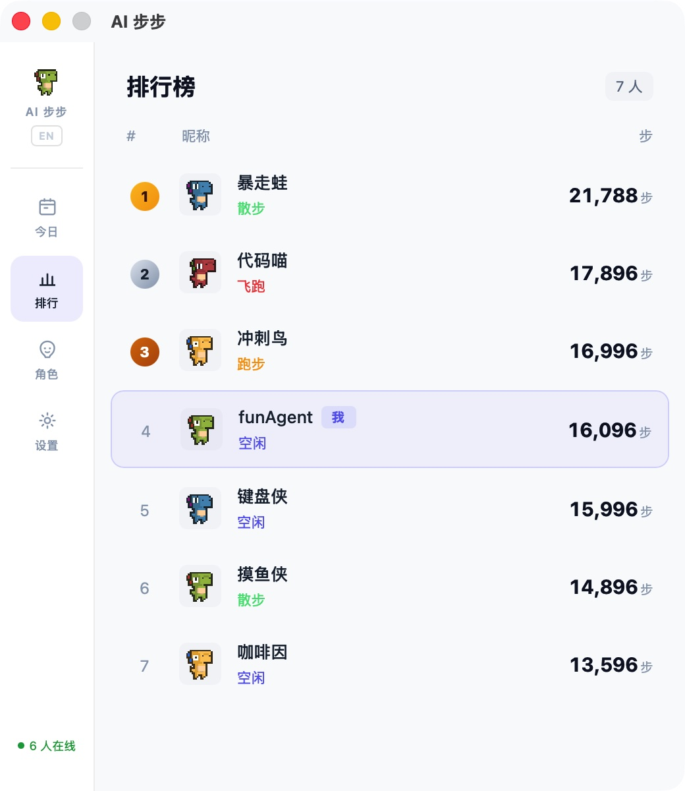
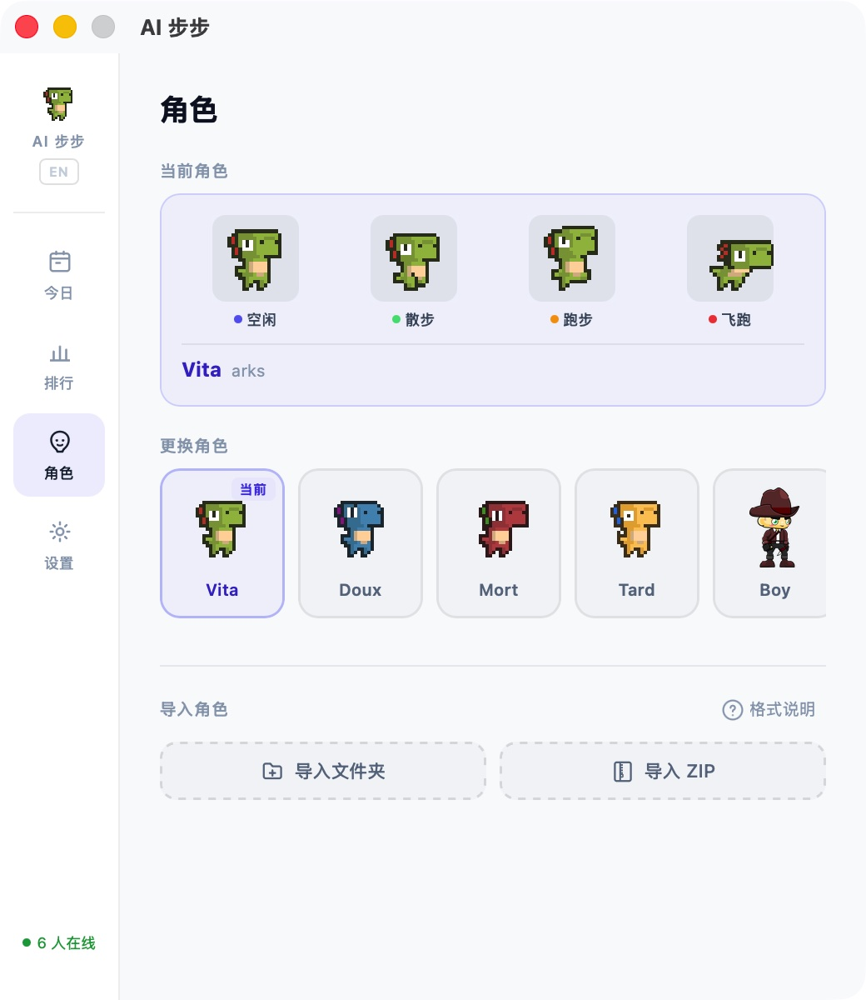
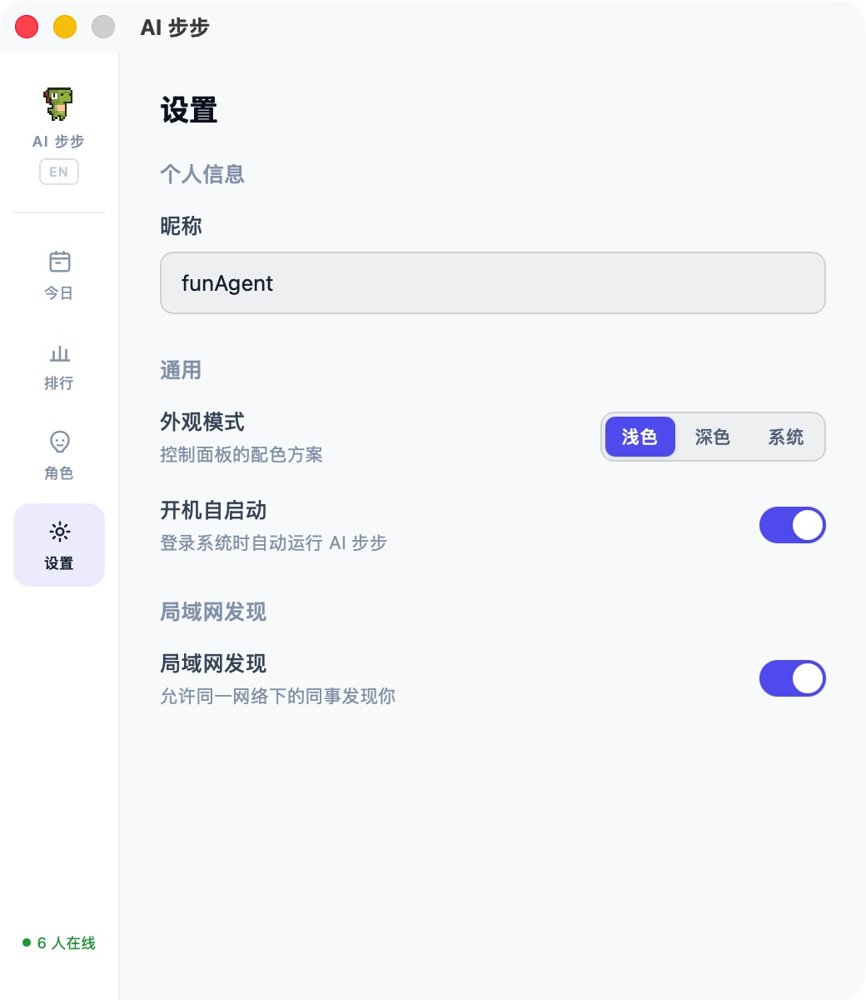

<div align="center">

# AI 步步 (AIbubu)

**AI 时代的编码计步器**

监测你的 AI 编码工具使用情况，将活跃度转化为步数，驱动桌面宠物行走。

[官网](https://aibubu.funagent.app) · [下载](https://github.com/funAgent/ai-bubu/releases) · [English](./README_EN.md)

<video src="packages/site/public/demo/demo.mp4" width="100%" autoplay loop muted playsinline></video>

</div>

---

## 它是什么？

AI 步步是一个桌面宠物应用，它会实时监测你使用 Cursor、Claude Code、Trae 等 AI 编码工具的活跃度，把"编码活跃度"量化为步数——你越活跃，宠物跑得越欢。

- **静止** — 你在摸鱼
- **行走** — 你正在温和地编码
- **奔跑** — 你和 AI 配合得很默契
- **冲刺** — 你正在疯狂输出

## 功能

- **AI 工具活跃度监测** — 支持 Cursor、Claude Code、Codex CLI、Trae、Copilot、Windsurf、Cline、Aider、Continue、Gemini CLI、Goose 等
- **步数计数器** — 每日步数统计与历史记录
- **桌面宠物** — 透明窗口、始终置顶、像素风精灵动画
- **皮肤系统** — 8 款内置皮肤，支持自定义导入
- **局域网社交** — 自动发现同事的宠物，查看排行榜
- **双语界面** — 中文 / English
- **开机自启** — 安静地运行在你的桌面上

## 截图

|                              今日概览                               |                               排行榜                               |
| :-----------------------------------------------------------------: | :----------------------------------------------------------------: |
|  |  |

|                             皮肤系统                              |                                 设置                                  |
| :---------------------------------------------------------------: | :-------------------------------------------------------------------: |
|  |  |

## 安装

### macOS

从 [Releases](https://github.com/funAgent/ai-bubu/releases) 下载最新的 `.dmg` 文件。

> 要求 macOS 14.0+

### Windows

从 [Releases](https://github.com/funAgent/ai-bubu/releases) 下载最新的 `.msi` 文件。

### Linux

从 [Releases](https://github.com/funAgent/ai-bubu/releases) 下载 `.AppImage` 或 `.deb` 文件。

## 从源码构建

### 前置条件

- [Node.js](https://nodejs.org/) 22+
- [pnpm](https://pnpm.io/) 9+
- [Rust](https://www.rust-lang.org/tools/install) (stable)
- Tauri 2 系统依赖：参见 [Tauri 官方文档](https://v2.tauri.app/start/prerequisites/)

### 步骤

```bash
# 克隆仓库
git clone https://github.com/funAgent/ai-bubu.git
cd ai-bubu

# 安装依赖
pnpm install

# 开发模式
pnpm tauri dev

# 构建生产版本
pnpm tauri build
```

## 项目结构

```
packages/
├── app/                 # Tauri 桌面应用
│   ├── src/             # Vue 3 前端
│   ├── src-tauri/       # Rust 后端
│   ├── providers/       # AI 工具监测配置 (TOML)
│   └── public/skins/   # 内置皮肤资源
└── site/                # Astro 官网
scripts/                 # 工具脚本
```

## 皮肤系统

内置 8 款皮肤：Vita、Doux、Mort、Tard、Boy、Dinosaur、Line、Glube。

支持自定义皮肤导入，详见 [贡献指南](./CONTRIBUTING.md) 和 [BRANDING.md](./BRANDING.md)。

## 局域网社交

开启局域网发现后，AI 步步会通过 UDP 广播（端口 23456）自动发现同一网络中的其他用户，在排行榜中展示各自的今日步数。

## 技术栈

| 层       | 技术                                                |
| -------- | --------------------------------------------------- |
| 桌面框架 | Tauri 2, Rust                                       |
| 前端     | Vue 3, Pinia, Vite                                  |
| 官网     | Astro                                               |
| 测试     | Vitest                                              |
| 工程化   | pnpm workspace, ESLint, Prettier, Husky, commitlint |

## 贡献

欢迎贡献！请阅读 [CONTRIBUTING.md](./CONTRIBUTING.md) 了解详情。

### 贡献者

<a href="https://github.com/funAgent/ai-bubu/graphs/contributors">
  
</a>

## 联系我们

<div align="center">

[](https://x.com/funAgentApp)
[](https://x.com/hash-panda)

**关注公众号和小红书，获取最新动态：**

|                                 公众号                                 |                                  小红书                                  |
| :--------------------------------------------------------------------: | :----------------------------------------------------------------------: |
|  |  |

</div>

## Star History

<div align="center">

[](https://star-history.com/#funAgent/ai-bubu&Date)

</div>

## 致谢

- 像素恐龙角色来自 [arks](https://arks.itch.io/)（itch.io）

## 许可证

[MIT](./LICENSE)
