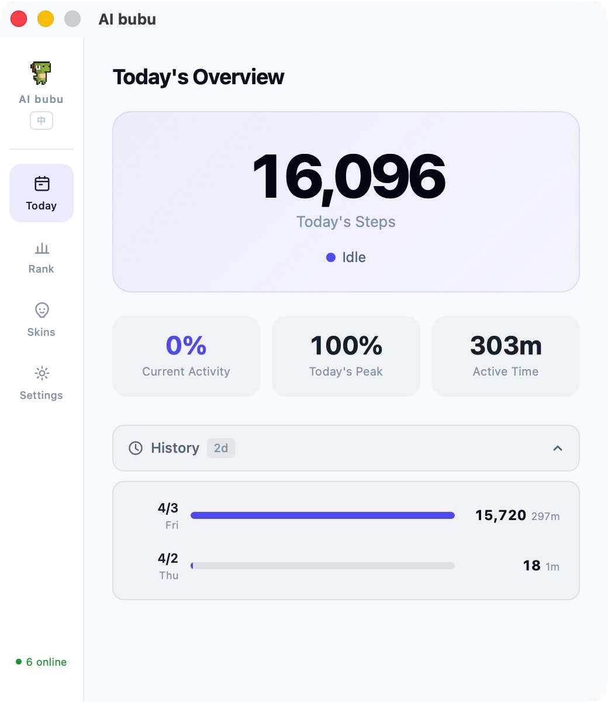
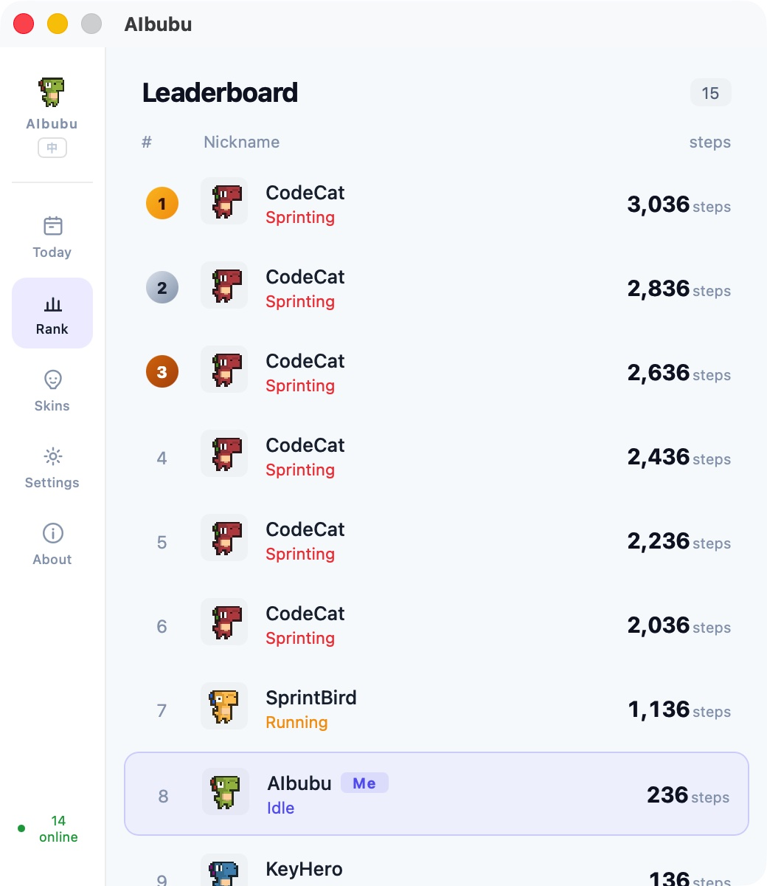
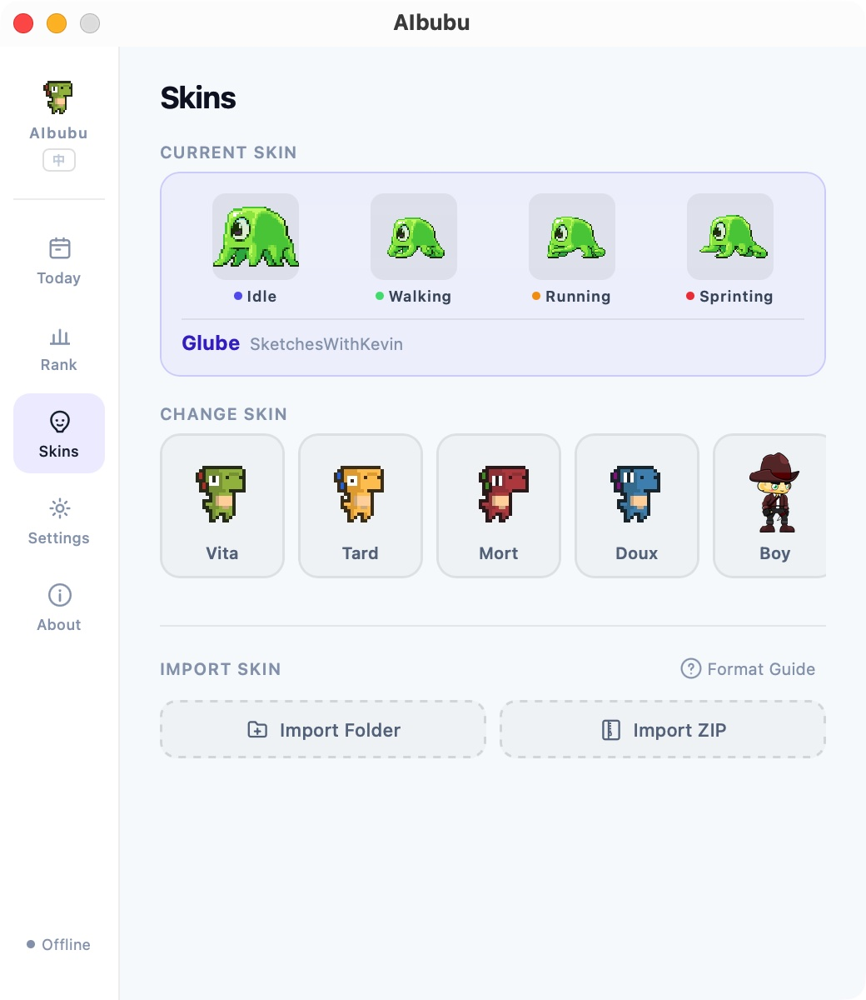
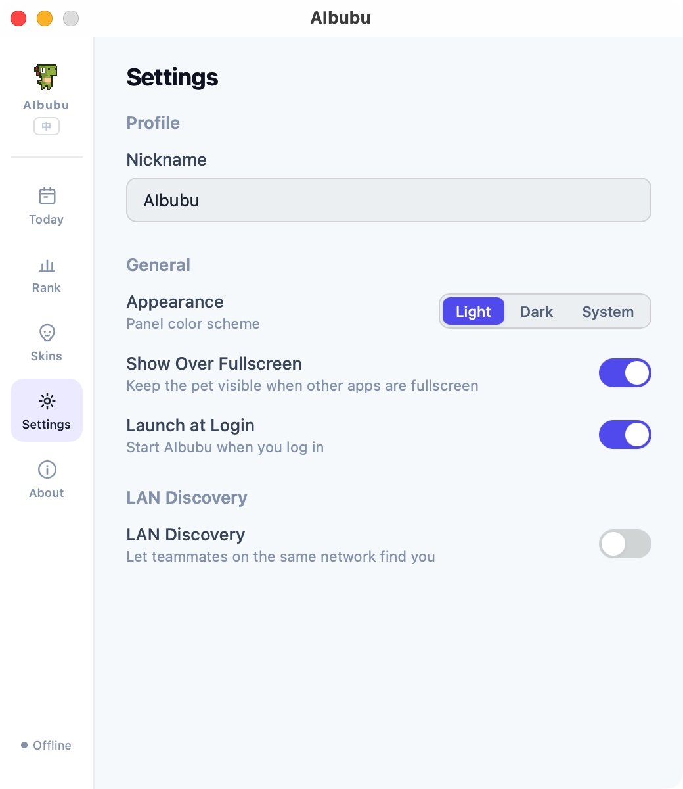

<div align="center">

# AIbubu

**A coding step counter for the AI era**

Monitor your AI coding tool activity, turn it into step counts, and drive a desktop pet to walk.

[Website](https://aibubu.app) · [Download](https://github.com/funAgent/ai-bubu/releases) · [中文](./README_CN.md)

<video src="https://aibubu.app/demo/demo_en.mp4" width="100%" autoplay loop muted playsinline></video>

</div>

---

## What is it?

AIbubu is a desktop pet app that monitors your usage of AI coding tools like Cursor, Claude Code, Copilot, etc., and quantifies your "coding activity" into steps — the more active you are, the faster your pet runs.

- **Idle** — you're slacking off
- **Walk** — you're coding at a gentle pace
- **Run** — you and AI are in great sync
- **Sprint** — you're on fire

## Features

- **AI Tool Activity Monitoring** — supports Cursor, Claude Code, Codex CLI, Trae, Copilot, Windsurf, Cline, Aider, Continue, Gemini CLI, Goose, and more
- **Step Counter** — daily step counts with history tracking
- **Desktop Pet** — transparent, always-on-top window with pixel-art sprite animations
- **Skin System** — 8 built-in skins with custom import support
- **LAN Social** — auto-discover teammates' pets and view the leaderboard
- **Bilingual UI** — Chinese / English
- **Auto-start** — runs quietly on your desktop

## Screenshots

|                                 Today                                  |                              Leaderboard                              |
| :--------------------------------------------------------------------: | :-------------------------------------------------------------------: |
|  |  |

|                                Skins                                 |                                 Settings                                 |
| :------------------------------------------------------------------: | :----------------------------------------------------------------------: |
|  |  |

## Installation

### macOS

Download the latest `.dmg` from [Releases](https://github.com/funAgent/ai-bubu/releases).

> Requires macOS 14.0+

### Windows

Download the latest `.msi` from [Releases](https://github.com/funAgent/ai-bubu/releases).

### Linux

Download `.AppImage` or `.deb` from [Releases](https://github.com/funAgent/ai-bubu/releases).

## Build from Source

### Prerequisites

- [Node.js](https://nodejs.org/) 22+
- [pnpm](https://pnpm.io/) 9+
- [Rust](https://www.rust-lang.org/tools/install) (stable)
- Tauri 2 system dependencies: see [Tauri docs](https://v2.tauri.app/start/prerequisites/)

### Steps

```bash
# Clone the repo
git clone https://github.com/funAgent/ai-bubu.git
cd ai-bubu

# Install dependencies
pnpm install

# Development mode
pnpm tauri dev

# Development mode (with mock peer data)
pnpm dev:mock

# Build for production
pnpm tauri build
```

## Project Structure

```
packages/
├── app/                 # Tauri desktop application
│   ├── src/             # Vue 3 frontend
│   ├── src-tauri/       # Rust backend
│   ├── providers/       # AI tool monitor configs (TOML)
│   └── public/skins/   # Built-in skin assets
└── site/                # Astro marketing site
scripts/                 # Utility scripts
```

## Skin System

8 built-in skins: Vita, Doux, Mort, Tard, Boy, Dinosaur, Line, Glube.

Custom skin import is supported. See the [Contributing Guide](./CONTRIBUTING.md) and [BRANDING.md](./BRANDING.md) for details.

## LAN Social

When LAN discovery is enabled, AIbubu uses UDP broadcast (port 23456) to auto-discover other users on the same network and display everyone's daily steps on the leaderboard.

## Tech Stack

| Layer             | Technology                                          |
| ----------------- | --------------------------------------------------- |
| Desktop framework | Tauri 2, Rust                                       |
| Frontend          | Vue 3, Pinia, Vite                                  |
| Website           | Astro                                               |
| Testing           | Vitest                                              |
| Tooling           | pnpm workspace, ESLint, Prettier, Husky, commitlint |

## Contributing

Contributions are welcome! Please read [CONTRIBUTING.md](./CONTRIBUTING.md) for details.

### Contributors

<a href="https://github.com/funAgent/ai-bubu/graphs/contributors">
  
</a>

## Contact

<div align="center">

[](https://x.com/funAgentApp)
[](https://x.com/hash-panda)

</div>

## Star History

<div align="center">

[](https://star-history.com/#funAgent/ai-bubu&Date)

</div>

## Credits

- Pixel dinosaur characters by [arks](https://arks.itch.io/) (itch.io)

## License

[MIT](./LICENSE)
