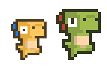
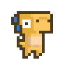
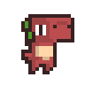
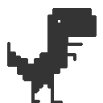

<div align="center">

# AI 步步 (AIbubu)

**AI 时代的编码计步器**

监测你的 AI 编码工具使用情况，将活跃度转化为步数，驱动桌面宠物行走。还能和同事一起赛跑。

[官网](https://aibubu.app) · [下载](https://github.com/funAgent/ai-bubu/releases) · [English](./README.md) · [](https://github.com/funAgent/ai-bubu/stargazers)

https://github.com/user-attachments/assets/94ac53d8-b835-4cbf-afa8-84cbb494dd9f

</div>

---

## 它是什么？

AI 步步是一个桌面宠物应用，它会实时监测你使用 Cursor、Claude Code、Trae 等 AI 编码工具的活跃度，把"编码活跃度"量化为步数——你越活跃，宠物跑得越欢。

- **静止** — 你在摸鱼
- **行走** — 你正在温和地编码
- **奔跑** — 你和 AI 配合得很默契
- **冲刺** — 你正在疯狂输出

|                            Idle                            |                            Walk                            |                            Run                            |                            Sprint                            |
| :--------------------------------------------------------: | :--------------------------------------------------------: | :-------------------------------------------------------: | :----------------------------------------------------------: |
|  |  |  |  |

## 功能

### AI 工具活跃度监测

AI 步步通过可插拔的适配器系统实时监测你的 AI 编码工具——无需安装钩子、无需修改配置，完全被动读取本地已有数据（数据库、日志、进程信息）。

- **Cursor** — 轮询本地 SQLite 数据库（`state.vscdb`），将 Composer 状态 `generating` / `streaming` 映射为高活跃度
- **Claude Code** — 解析 `~/.claude/projects/` 下的 JSONL 会话日志
- **Codex CLI** — 解析 `rollout-*.jsonl` 会话日志
- **Trae** — 监控进程 CPU 使用率
- **进程回退机制** — 当主适配器无法获取数据时，自动降级到进程级别的 CPU 检测
- **多工具加速** — 同时使用多个 AI 工具时，宠物的进阶速度会加速叠加（2 工具 ×1.8，3+ 工具 ×2.5 倍速）
- **社区可扩展** — 通过编写 TOML 配置文件即可添加新的工具支持，提供 5 种适配器类型（`sqlite` / `jsonl` / `process` / `file_mtime` / `vscode_ext`）

### 运动与心情

**运动状态** — 宠物的速度反映你持续编码的时长：

| 状态 | 条件           | 活跃度评分 |
| :--: | :------------- | :--------- |
| 静止 | 无活跃度       | 0          |
| 行走 | 活跃 < 60s     | 25–49      |
| 奔跑 | 持续活跃 60s+  | 50–74      |
| 冲刺 | 持续活跃 180s+ | 75–100     |

**45 秒冷却桥接**：Agent 工具调用间的短暂间隙不会让宠物回到静止，保持连续的活跃感。

**心情系统** — 在运动状态之上叠加视觉效果：

| 心情    | 触发条件          | 视觉效果                            |
| :------ | :---------------- | :---------------------------------- |
| 困倦 💤 | 空闲 10 分钟      | 漂浮的 "zzz" 字母 + 呼吸动画 + 变暗 |
| 兴奋 🔥 | 冲刺或活跃度 ≥ 90 | 速度烟尘粒子 + 抖动 + 发光          |
| 正常    | 默认              | 无特效                              |

### 宠物互动

- **单击** — 抚摸反应，飘出 ❤️ 💕 粒子
- **双击** — 戳一下反应，弹出 ❗ ❓ 粒子
- **长按拖拽** — 按住宠物拖到屏幕任意位置（150ms 判定区分点击与拖拽）
- **右键** — 打开社交面板
- **悬停提示** — "按住拖拽" / "单击互动 · 右键菜单"

### 步数统计与数据洞察

- **每日步数** — 每次监测更新根据当前活跃度评分累加 `⌊score / 10⌋` 步
- **90 天历史** — 按日本地存储，午夜自动翻天
- **数据洞察面板**：
  - 7 天 / 30 天趋势图
  - 24 小时活跃时段热力图
  - 各 AI 工具使用时长占比
  - 连续活跃天数（Streak）

### 皮肤系统

内置 8 款皮肤，支持自定义导入：

|                              Vita                               |                              Tard                               |                              Mort                               |                              Doux                               |                              Boy                               |                              Dinosaur                               |                              Glube                               |                              Line                               |
| :-------------------------------------------------------------: | :-------------------------------------------------------------: | :-------------------------------------------------------------: | :-------------------------------------------------------------: | :------------------------------------------------------------: | :-----------------------------------------------------------------: | :--------------------------------------------------------------: | :-------------------------------------------------------------: |
|  |  |  |  |  |  |  |  |

- **自定义导入** — 支持文件夹导入或 ZIP 压缩包导入
- **多格式支持** — Sprite Sheet (PNG)、Lottie、GIF、APNG
- **4 种必需动画状态** — idle / walk / run / sprint，可自定义帧率、帧数、起始帧
- **下载示例模板** — 内置示例和制作说明，方便创作

### 局域网社交 

- **自动发现** — UDP 广播（端口 23456），自动发现同一网络中的队友
- **排行榜** — 按每日步数排名
- **5 秒心跳** — 实时同步昵称、步数、活跃度评分、运动状态、皮肤
- **同伴护送** — 在线的队友会以小型宠物的形式陪伴在你的宠物旁边
- **隐私优先** — 仅限局域网，无服务器，无需账号

### 系统

- **透明窗口** — 无边框、透明背景、始终置顶、不占任务栏
- **macOS 全屏覆盖** — 可选在其他应用全屏时仍显示宠物（NSPanel 实现）
- **系统托盘** — 显示/隐藏宠物、排行榜、退出；托盘图标实时显示宠物精灵帧
- **开机自启** — 支持 macOS / Windows / Linux
- **自动更新** — 通过 GitHub Releases 检查新版本，应用内下载安装
- **双语界面** — 中文 / English，自动检测系统语言
- **主题切换** — 浅色 / 深色 / 跟随系统
- **隐私保护** — 所有数据仅存储在本地，不会上传到任何服务器
- **跨平台** — macOS 14+、Windows、Linux（AppImage / deb）

## 截图

|                              今日概览                               |                               排行榜                               |
| :-----------------------------------------------------------------: | :----------------------------------------------------------------: |
|  |  |

|                             皮肤系统                              |                                 设置                                  |                                关于                                 |
| :---------------------------------------------------------------: | :-------------------------------------------------------------------: | :-----------------------------------------------------------------: |
|  |  |  |

## 安装

### macOS

从 [Releases](https://github.com/funAgent/ai-bubu/releases) 下载最新的 `.dmg` 文件。

> 要求 macOS 14.0+

### Windows

从 [Releases](https://github.com/funAgent/ai-bubu/releases) 下载最新的 `.msi` 文件。

### Linux

从 [Releases](https://github.com/funAgent/ai-bubu/releases) 下载 `.AppImage` 或 `.deb` 文件。

## 从源码构建

### 前置条件

- [Node.js](https://nodejs.org/) 22+
- [pnpm](https://pnpm.io/) 9+
- [Rust](https://www.rust-lang.org/tools/install) (stable)
- Tauri 2 系统依赖：参见 [Tauri 官方文档](https://v2.tauri.app/start/prerequisites/)

### 步骤

```bash
# 克隆仓库
git clone https://github.com/funAgent/ai-bubu.git
cd ai-bubu

# 安装依赖
pnpm install

# 开发模式
pnpm tauri dev

# 开发模式（带模拟同事数据）
pnpm dev:mock

# 构建生产版本
pnpm tauri build
```

## 项目结构

```
packages/
├── app/                 # Tauri 桌面应用
│   ├── src/             # Vue 3 前端
│   ├── src-tauri/       # Rust 后端
│   ├── providers/       # AI 工具监测配置 (TOML)
│   └── public/skins/   # 内置皮肤资源
└── site/                # Astro 官网
scripts/                 # 工具脚本
```

## 添加自定义 Provider

AI 步步的监测由 TOML 配置文件驱动。添加新的 AI 工具支持只需编写一个 `.toml` 文件，无需修改代码。详见 [Provider 配置指南](./packages/app/providers/README.md)。

## 技术栈

| 层       | 技术                                                |
| -------- | --------------------------------------------------- |
| 桌面框架 | Tauri 2, Rust                                       |
| 前端     | Vue 3, Pinia, Vite                                  |
| 官网     | Astro                                               |
| 测试     | Vitest                                              |
| 工程化   | pnpm workspace, ESLint, Prettier, Husky, commitlint |

## 贡献

欢迎贡献！请阅读 [CONTRIBUTING.md](./CONTRIBUTING.md) 了解详情。

### 贡献者

<a href="https://github.com/funAgent/ai-bubu/graphs/contributors">
  
</a>

## 联系我们

<div align="center">

[](https://x.com/funAgentApp)
[](https://x.com/hash-panda)

**关注公众号和小红书，获取最新动态：**

|                             公众号                              |                              小红书                               |
| :-------------------------------------------------------------: | :---------------------------------------------------------------: |
|  |  |

</div>

## 支持我们

如果 AI 步步让你的编码更有趣，请给个 ⭐ Star 支持一下——这能帮助更多开发者发现这个项目！

[](https://github.com/funAgent/ai-bubu)

## Star History

<div align="center">

[](https://star-history.com/#funAgent/ai-bubu&Date)

</div>

## 致谢

- 像素恐龙角色来自 [arks](https://arks.itch.io/)（itch.io）

## 许可证

[MIT](./LICENSE)
